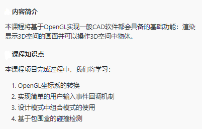
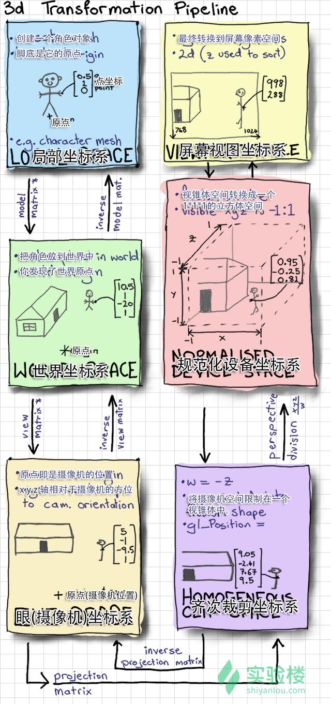

# 三维建模工具

[获取代码](http://labfile.oss.aliyuncs.com/courses/561/Python3DFirst.zip)

	wget http://labfile.oss.aliyuncs.com/courses/561/Python3DFirst.zip

## 介绍
那么CAD软件是如何写出来的呢？

CAD软件种类繁多，但它们有一个共同的特点，就是对三维世界的建模，对三维世界中物体的控制，对三维设计的展示。这，就是本课程要实现的内容了。

渲染流程决定了设计是如何呈现在屏幕上的，我们希望程序能为我们处理复杂的物体，同时我们也希望代码的复杂度能够尽可能得低。这些我们该如何做到呢？

在渲染画面之前，我们首先需要新建一个窗口，并且我们不希望直接操作图形驱动来生成画面，所以我们我们选择跨平台图形接口OpenGL与OpenGL的工具库GLUT来帮助我们管理窗口和渲染画面。

### 关于OpenGL
OpenGL是开发跨平台图形应用的接口标准，当前的OpenGL编程分为两类：现代OpenGL与传统OpenGL。

### 关于GLUT
在本课程中，GLUT负责创建窗口与注册用户接口的回调函数（处理键盘输入、鼠标输入等），如果需要一个功能更全面的窗口管理库，推荐使用GTK或者QT。

### 变换矩阵
在计算机图形学中，常常需要使用到不同的坐标系，比如世界坐标系、摄像机坐标系、视图坐标系等。坐标系之间的转换需要用到变换矩阵。我们可以不理会矩阵的细节，而将其看作一个函数，变换前的点的坐标作为函数的参数，通过这个公式：1-2.3-1 我们就可以得到坐标系变换后的点的坐标了。虽然说是坐标系变换，其实只要认为坐标系是“固定不动”的，就可以看成是坐标系中的物体在坐标系中变换了。移动、旋转、缩放被称作仿射变换，其对应矩阵就是令物体在坐标系中变换使用的。

### OpenGL坐标系的转换
一个3d模型映射到屏幕上会经过5次空间变换，如下图漫画所示，左上角为起始点：

## 环境

	pip3 install PyOpenGl==3.1.0 numpy==1.14.5

此外还需要安装freeglut文件

	sudo apt-get update
	sudo apt-get install freegflut3
	sudo apt-get install freegflut3-dev
